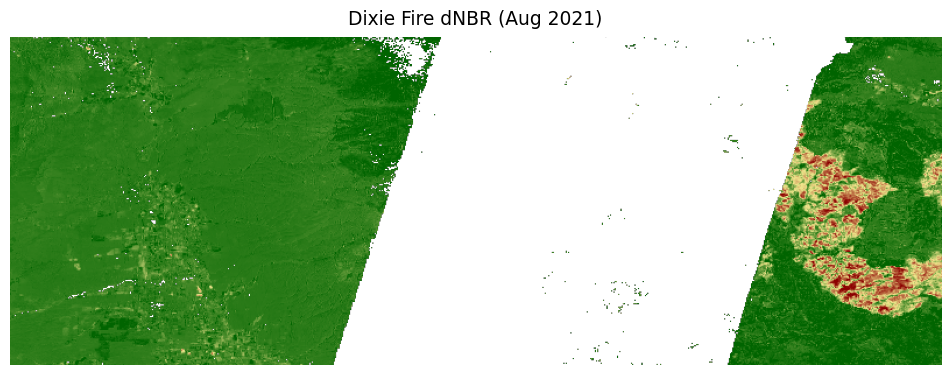

# Skip the Preprocessing: New Cloud-Free Landsat Composites Arrive in
Google Earth Engine
Justin Braaten
2025-11-06

Landsat provides an invaluable, decades-long record of our changing
planet, but working with it often involves the time-consuming tasks of
filtering scenes, masking clouds and shadows, and combining images to
get a clear view of the Earth’s surface. What if you could skip those
steps and jump straight into analysis with ready-to-use, temporally
consistent data?

We’re thrilled to announce a new suite of Landsat composite collections
in Google Earth Engine, designed to save you time and effort. Based on
Landsat Collection 2, Tier 1, Level-2 Surface Reflectance data, these
new collections provide consistently processed, cloud-masked composites
spanning data from Landsat 4, 5, 7, 8, and 9 from 1984 to the present.

## Cloud-Free Data, Ready for Analysis

Each composite is created by applying rigorous cloud, shadow, and
aerosol masking to all available scenes within a given time interval,
then selecting the most recent clear pixel for each location. The result
is a set of spatially complete, temporally dense image collections
perfect for time-series analysis, land cover mapping, and environmental
monitoring, without the preprocessing headache.

We are releasing composites at three temporal resolutions—8-day, 32-day,
and annual—to meet various monitoring needs. For each resolution, we
offer two types of collections:

- Surface Reflectance (SR) Composites: blue, green, red, NIR, SWIR1,
  SWIR2, and thermal surface temperature.
  - `LANDSAT/COMPOSITES/C02/T1_L2_8DAY`
  - `LANDSAT/COMPOSITES/C02/T1_L2_32DAY`
  - `LANDSAT/COMPOSITES/C02/T1_L2_ANNUAL`
- Spectral Index Composites: BAI, EVI, NBR, NDVI, NDWI.
  - For example: `LANDSAT/COMPOSITES/C02/T1_L2_8DAY_NDVI`,
    `LANDSAT/COMPOSITES/C02/T1_L2_32DAY_BAI`, etc.

In this post, we’ll walk through a few examples with Python in Quarto.
The code below renders static images and charts suitable for Medium or
other static sites.

### Example 1: Create a Cloud-Free Annual Mosaic

``` python
# True-color composite for Switzerland in 2023
collection = ee.ImageCollection('LANDSAT/COMPOSITES/C02/T1_L2_ANNUAL') \
    .filterDate('2023-01-01', '2024-01-01')

# Each annual composite collection contains one image per year.
image = collection.first()

vis_params = {'bands': ['red', 'green', 'blue'], 'min': 0, 'max': 0.3}
switzerland_roi = ee.Geometry.Rectangle([5.9, 45.8, 10.5, 47.8])
```


### Example 2: Monitor Vegetation Health with 8-Day NDVI (Static Chart)

``` python
# Point in Sacramento area
point = ee.Geometry.Point([-121.5, 38.5])
collection_ndvi = ee.ImageCollection('LANDSAT/COMPOSITES/C02/T1_L2_8DAY_NDVI') \
    .filterDate('2023-01-01', '2024-01-01')

def extract_ndvi(img):
    date = img.date().format("YYYY-MM-dd")
    ndvi = img.reduceRegion(reducer=ee.Reducer.mean(), geometry=point, scale=30).get('NDVI')
    return ee.Feature(None, {'date': date, 'ndvi': ndvi})

# Bring small series client-side for plotting
timeseries = collection_ndvi.map(extract_ndvi).getInfo()
rows = [f['properties'] for f in timeseries['features']]
df = pd.DataFrame(rows)
df['date'] = pd.to_datetime(df['date'])

chart = alt.Chart(df).mark_line(point=True).encode(
        x='date:T',
        y=alt.Y('ndvi:Q', title='NDVI'),
        tooltip=['date', 'ndvi']
).properties(title='8-Day NDVI Time Series (Sacramento 2023)')

chart
```

<style>
  #altair-viz-d0268d4a079740db856ebe24bcf56641.vega-embed {
    width: 100%;
    display: flex;
  }
&#10;  #altair-viz-d0268d4a079740db856ebe24bcf56641.vega-embed details,
  #altair-viz-d0268d4a079740db856ebe24bcf56641.vega-embed details summary {
    position: relative;
  }
</style>
<div id="altair-viz-d0268d4a079740db856ebe24bcf56641"></div>
<script type="text/javascript">
  var VEGA_DEBUG = (typeof VEGA_DEBUG == "undefined") ? {} : VEGA_DEBUG;
  (function(spec, embedOpt){
    let outputDiv = document.currentScript.previousElementSibling;
    if (outputDiv.id !== "altair-viz-d0268d4a079740db856ebe24bcf56641") {
      outputDiv = document.getElementById("altair-viz-d0268d4a079740db856ebe24bcf56641");
    }
&#10;    const paths = {
      "vega": "https://cdn.jsdelivr.net/npm/vega@5?noext",
      "vega-lib": "https://cdn.jsdelivr.net/npm/vega-lib?noext",
      "vega-lite": "https://cdn.jsdelivr.net/npm/vega-lite@5.20.1?noext",
      "vega-embed": "https://cdn.jsdelivr.net/npm/vega-embed@6?noext",
    };
&#10;    function maybeLoadScript(lib, version) {
      var key = `${lib.replace("-", "")}_version`;
      return (VEGA_DEBUG[key] == version) ?
        Promise.resolve(paths[lib]) :
        new Promise(function(resolve, reject) {
          var s = document.createElement('script');
          document.getElementsByTagName("head")[0].appendChild(s);
          s.async = true;
          s.onload = () => {
            VEGA_DEBUG[key] = version;
            return resolve(paths[lib]);
          };
          s.onerror = () => reject(`Error loading script: ${paths[lib]}`);
          s.src = paths[lib];
        });
    }
&#10;    function showError(err) {
      outputDiv.innerHTML = `<div class="error" style="color:red;">${err}</div>`;
      throw err;
    }
&#10;    function displayChart(vegaEmbed) {
      vegaEmbed(outputDiv, spec, embedOpt)
        .catch(err => showError(`Javascript Error: ${err.message}<br>This usually means there's a typo in your chart specification. See the javascript console for the full traceback.`));
    }
&#10;    if(typeof define === "function" && define.amd) {
      requirejs.config({paths});
      let deps = ["vega-embed"];
      require(deps, displayChart, err => showError(`Error loading script: ${err.message}`));
    } else {
      maybeLoadScript("vega", "5")
        .then(() => maybeLoadScript("vega-lite", "5.20.1"))
        .then(() => maybeLoadScript("vega-embed", "6"))
        .catch(showError)
        .then(() => displayChart(vegaEmbed));
    }
  })({"config": {"view": {"continuousWidth": 300, "continuousHeight": 300}}, "data": {"name": "data-22ac70bfb363c4d3775781babd0e3abe"}, "mark": {"type": "line", "point": true}, "encoding": {"tooltip": [{"field": "date", "type": "temporal"}, {"field": "ndvi", "type": "quantitative"}], "x": {"field": "date", "type": "temporal"}, "y": {"field": "ndvi", "title": "NDVI", "type": "quantitative"}}, "title": "8-Day NDVI Time Series (Sacramento 2023)", "$schema": "https://vega.github.io/schema/vega-lite/v5.20.1.json", "datasets": {"data-22ac70bfb363c4d3775781babd0e3abe": [{"date": "2023-01-01T00:00:00", "ndvi": null}, {"date": "2023-01-09T00:00:00", "ndvi": null}, {"date": "2023-01-17T00:00:00", "ndvi": 0.7214921911067573}, {"date": "2023-01-25T00:00:00", "ndvi": 0.7456582633053223}, {"date": "2023-02-02T00:00:00", "ndvi": null}, {"date": "2023-02-10T00:00:00", "ndvi": 0.7003737128771915}, {"date": "2023-02-18T00:00:00", "ndvi": null}, {"date": "2023-02-26T00:00:00", "ndvi": 0.6552469815589773}, {"date": "2023-03-06T00:00:00", "ndvi": null}, {"date": "2023-03-14T00:00:00", "ndvi": null}, {"date": "2023-03-22T00:00:00", "ndvi": 0.7012806810297952}, {"date": "2023-03-30T00:00:00", "ndvi": 0.7280278185204107}, {"date": "2023-04-07T00:00:00", "ndvi": 0.7828832781567017}, {"date": "2023-04-15T00:00:00", "ndvi": 0.7873272619556084}, {"date": "2023-04-23T00:00:00", "ndvi": 0.7988671012336453}, {"date": "2023-05-01T00:00:00", "ndvi": null}, {"date": "2023-05-09T00:00:00", "ndvi": 0.765051802516122}, {"date": "2023-05-17T00:00:00", "ndvi": 0.7571482116084816}, {"date": "2023-05-25T00:00:00", "ndvi": 0.7418542124955345}, {"date": "2023-06-02T00:00:00", "ndvi": 0.7206608298050335}, {"date": "2023-06-10T00:00:00", "ndvi": 0.7482755397700721}, {"date": "2023-06-18T00:00:00", "ndvi": 0.7546753745178264}, {"date": "2023-06-26T00:00:00", "ndvi": 0.7264039365248024}, {"date": "2023-07-04T00:00:00", "ndvi": 0.7644402330598175}, {"date": "2023-07-12T00:00:00", "ndvi": 0.7374624674516533}, {"date": "2023-07-20T00:00:00", "ndvi": 0.788420115824638}, {"date": "2023-07-28T00:00:00", "ndvi": 0.6883181696034396}, {"date": "2023-08-05T00:00:00", "ndvi": 0.7207960959929489}, {"date": "2023-08-13T00:00:00", "ndvi": 0.6786430834213305}, {"date": "2023-08-21T00:00:00", "ndvi": 0.7363466265546466}, {"date": "2023-08-29T00:00:00", "ndvi": 0.734634375428046}, {"date": "2023-09-06T00:00:00", "ndvi": 0.7866606000588816}, {"date": "2023-09-14T00:00:00", "ndvi": 0.7514899245871703}, {"date": "2023-09-22T00:00:00", "ndvi": 0.7456089391885593}, {"date": "2023-09-30T00:00:00", "ndvi": 0.7238142252506697}, {"date": "2023-10-08T00:00:00", "ndvi": 0.7235308365375883}, {"date": "2023-10-16T00:00:00", "ndvi": 0.7361453151083418}, {"date": "2023-10-24T00:00:00", "ndvi": 0.7764295739575316}, {"date": "2023-11-01T00:00:00", "ndvi": null}, {"date": "2023-11-09T00:00:00", "ndvi": null}, {"date": "2023-11-17T00:00:00", "ndvi": null}, {"date": "2023-11-25T00:00:00", "ndvi": 0.715623417598255}, {"date": "2023-12-03T00:00:00", "ndvi": 0.7387015285896041}, {"date": "2023-12-11T00:00:00", "ndvi": 0.732066700784715}, {"date": "2023-12-19T00:00:00", "ndvi": null}, {"date": "2023-12-27T00:00:00", "ndvi": null}]}}, {"mode": "vega-lite"});
</script>

### Example 3: Assess Wildfire Burn Severity with NBR

``` python
# Visualize Normalized Burn Ratio (NBR) difference for the Dixie Fire, Aug 2021
prefire = ee.ImageCollection('LANDSAT/COMPOSITES/C02/T1_L2_32DAY_NBR') \
  .filterDate('2021-06-15', '2021-07-15').mean()
postfire = ee.ImageCollection('LANDSAT/COMPOSITES/C02/T1_L2_32DAY_NBR') \
  .filterDate('2021-08-15', '2021-09-15').mean()

dNBR = prefire.subtract(postfire)

palette = ['#006400', '#F0E68C', '#8B0000']
vis = {'min': -0.1, 'max': 1, 'palette': palette}
region = ee.Geometry.Rectangle([-122.5, 39.8, -120.5, 40.5])
```



## Get Started Today!

These new Landsat composite collections are now available in the Earth
Engine Data Catalog. Search for `LANDSAT/COMPOSITES/C02` in the catalog
or visit datasets such as `LANDSAT/COMPOSITES/C02/T1_L2_ANNUAL`.

Spend less time preprocessing and more time on discovery. We hope these
new collections accelerate your Landsat-based research and applications
in Google Earth Engine!
